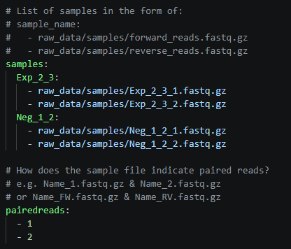

# cel-rnaseq: A Snakemake pipeline for *Caenorhabditis elegans* RNA-seq data

## Overview
Snakemake pipeline for Differential Gene Expression of *Caenorhabditis elegans* RNA-seq data. It accepts raw fastq files and generates raw count matrices aggregated into an RData file.

The following is a tutorial on the usage of this pipeline.
- If you are using Windows, start from **Step 1**.
- If you are using MacOS or Linux, start from **Step 2**.
- If you already configured the pipeline previously, start from **Step 6**.

## Installation

### 1. Install Ubuntu in WSL2
When working in Windows, we will install Ubuntu as a subsystem since Snakemake works best in a Unix shell. WSL2 is already installed in Windows 11 and many Windows 10 versions, but for older systems check [this tutorial](https://learn.microsoft.com/en-us/windows/wsl/install-manual).

In a Windows PowerShell, run:

```
wsl --install Ubuntu-24.04
```
Otherwise, `wsl --install` will install the default Linux distribution (usually the latest LTS Ubuntu, which as of May 2026 is Ubuntu 24.04) and you can see all the distribution options at `wsl --list --online` .

Then, the PowerShell will prompt user and password creation like this:
```
Create a default Unix user account:
New password:
Retype new password:
```
After, the PowerShell will run Ubuntu.

For ease of use, install the [Terminal app](https://apps.microsoft.com/detail/9n0dx20hk701) because it is visually intuitive. You can open it and select the Ubuntu terminal:

<div align="center">
  
</div>


More complete tutorials can be found [from Microsoft](https://learn.microsoft.com/en-us/windows/wsl/install) and [from AskUbuntu](https://documentation.ubuntu.com/wsl/latest/howto/install-ubuntu-wsl2/).

### 2. Clone the Pipeline Repository

Use git to download the pipeline from GitHub:

```
git clone https://github.com/nuriagaralon/cel-rnaseq.git
```

### 3. Install conda via Miniforge

The pipeline used Miniforge v24.11.3, which can be downloaded with:

```
wget https://github.com/conda-forge/miniforge/releases/download/24.11.3-0/Miniforge3-Linux-x86_64.sh
```

The latest version can be downloaded with:
```
wget https://github.com/conda-forge/miniforge/releases/latest/download/Miniforge3-Linux-x86_64.sh
```

Afterwards, install and answer yes to all questions:

```
bash Miniforge3-Linux-x86_64.sh
```
Then, reset the console so it loads our conda installation:

```
 source ~/.bashrc
```

### 4. Configure the general conda environment

Create the environment for Snakemake using the provided file, and activate it.

```
conda env create -f cel-rnaseq/config/snake_env.yaml
conda activate snakemake
```

### 5. Prepare the reference files

Download the reference files, using the `dl_WBcel235_ref.sh` script:

```
cd cel-rnaseq/raw_data/references
bash dl_WBcel235_ref.sh
```

This places the required FASTA (genome), GTF (annotation) and feature information files in the resources folder. 

Return to the `cel-rnaseq` folder:

```
cd ../..
```

## Running the pipeline
> [!WARNING]
> If the pipeline has been run before, make sure to clean the `results` folder to avoid pipeline crashes.

### 6. Prepare the raw reads, sample metadata and config metadata

The Ubuntu folders can be acessed from the Windows file system. To edit files easily, you can [run VSCode with WSL](https://learn.microsoft.com/es-es/windows/wsl/tutorials/wsl-vscode).

Add the raw sequencing files (fastq.gz) and metadata file (tsv) to the samples folder, at `cel-rnaseq/raw_data/samples`.

Edit the general config file `cel-rnaseq/config/snake_config.yaml` to include the sample names and file paths, and other experimental parameters.

For example, this is a snapshot of the `snake_config.yaml` file for two samples: Exp_2_3 and Neg_1_2.
<div align="center">
  
</div>

- The RNA-seq library must be a paired-reads library.
- In `samples`, write each sample name and indicate the two files (forward and reverse reads) that are found in the `raw_data/samples` folder.
- In `pairedreads` indicate the used nomenclature: each sample has two files like `Neg_1_2_{pairedreads}.fastq.gz`. In this case it is 1 and 2, but sometimes it is FW and RV or F and R.
- In `metadata`, write the path to the sample metadata file. The first column of this file must have `Sample.ID` as a header, and the names of the samples as written in `samples` as rows.

### 7. Dry Run

From the `cel-rnaseq` folder (use `cd ..` to move back one folder as needed and `cd folder/` to move to a folder), run:

```
snakemake -np all
```

This will start a dry run where snakemake runs `rule all` (which executes the entire pipeline) and checks the pipeline logic but doesn't execute the programs (`-n` flag) and prints the process to the terminal (`-p` flag).

From this, we can see if there was an error with the config file, if the raw data was not added, if the reference data is missing, and other basic problems.

### 8. Execute the Workflow
Run the full pipeline with the `--use-conda` flag for reproducibility:

```
snakemake -p --use-conda all
```
The pipeline can be run with less than the full capacity of the computer (recommended for multitasking) at the cost of longer runtime. First, check the available cores:
```
nproc
```
Then, run using a specific number of cores:

```
snakemake -p --use-conda --cores 8 all
```

> [!TIP]
> The jobs are usually programmed for $2^p$ cores, so 4, 8, 16 are good numbers.

### 9. Monitor Performance
More information on the run can be found in the log file, of which the name is printed after the pipeline finishes or stops due to an error.

If an error occurs, the pipeline may crash and display error messages in red text to the terminal. In many cases, Snakemake will automatically remove incomplete output files from the failed rule, so simply rerunning the same command as Step 8 may resolve temporary issues.

> [!TIP]
> If the pipeline gets interrupted, Snakemake can detect which jobs already finished, so rerunning `snakemake -p --use-conda all` will only rerun the necessary steps.

A problem with `snake_config.yaml` would have been detected in the dry run, so failures at this stage can be: 

-	Bad file contents (e.g. the RNAseq FASTA files or reference files are corrupted)

-	Conda environment installation issues (remove the offending environment from `.snakemake/conda`)

-	Disk space errors (free up storage or process less samples at a time)

-	Incorrectly generated outputs

-	Tool failures

The **MultiQC tool** can cause issues if there is a past file in the folder: it will automatically add `_1` after the created file, and since it is not the file Snakemake is looking for, it will think the job failed. Erase the files and try again.

## Downstream analysis: DGE and functional enrichment
After running the full pipeline, the output is the `gene_counts_data.RData` file. This contains three data tables:

- Aggregated count data from gene expression quantification
- Sample metadata
- Feature data linking locus tags to gene identifiers

This data is analysed in the `workflow/scripts/dge_deseq2.R` file, where `Sample.Group` defines the experimental condition used for differential expression analysis.

The script was originally written for a specific dataset, but can serve as a start for new analyses. Several variables and settings are dataset-specific and should be reviewed before use:
- Metadata variables: `Generation` and `Type` are the analysed variables, which combined they form `Sample.Group`; `Incubator` and `Replicate`, which are possible batch variables.
- The reference level used for differential expression analysis, currently `Negative_G1`.
- `sample_list`: list of pairwise contrasts to analyse. A commented line in the script generates all possible pairwise contrasts. Alternatively, specify the desired contrasts manually as a list, where each numerator–denominator pair defines one contrast.
- `contrast_list`: subset of contrasts which are passed to the plotting functions (MA plot, volcano plot, enrichment analysis dot plot).
- Sample labels used in PCA visualization: `Exp_2_3` and `Neg_1_2`
- Genes `CELE_T07G12.5` and `CELE_C55B7.4` visualized with `plotCounts()`
- Last enrichment analysis, with data extracted from the venn diagrams' data.
 
 If these dataset-specific components are updated appropriately, this script can be adapted for different RNA-seq analyses.

## Results
### MultiQC outputs
MultiQC outputs have a Help button for each category which explains what the plot means and what it should look like. In some plots, it also explains what might cause FastQC to flag the metric as low quality, even if it is as expected or not problematic for RNAseq.

The most important metric is the Sequence Quality Histogram, which should have all bases in the green range (above Phred score of 30). Then, Per Sequence Quality Scores and GC and N content. Adapter content should also be low after trimming.

Possible non problematic FastQC failures (which are orange or red in the heatmap at the bottom) include:

- Per Tile Sequence Quality: is generally not a problem as long as Sequence Quality Histograms are good, most of the tiles are blue and any prominent lines are green.
- Per Base Sequence Content: Ignoring the first few base pairs, as long as the rest are parallel lines (or a brown heatmap), the quality is good.
- Sequence Length Distribution: It should be green before trimming, but it often shows as orange after trimming.
- Sequence Duplication Levels: If the duplication is in the 10 to 1k range, these are normal values for RNA-seq, due to highly expressed transcripts being highly duplicated sequences.

### Alignment and expression
When interpreting these summary metrics, we should not focus on differences between samples if they are small, but rather on the overall quality.

For alignment quality, the most important metric is the **Unique_pct**, which should be high (over 90% is best), as it reflects how well the reads aligned to a single location. Unmapped_pct should be very low, as it is the reads that did not map to any location, and it is typically due to contamination if the MultiQC metrics were good.

For quantification, the most important metric is the **Assigned_pct**, which should be high (over 80%), as it reflects the reads that were counted and can be used for downstream analyses. The rest indicate reads that will not be used, but it may be useful to know if it is because they did not map anywhere (NoFeatures_pct) or they mapped to multiple features (MultiMapping_pct) or were ambiguous (Ambiguity_pct).

### Differential gene expression
#### Exploratory Data Analysis
EDA is a way to assess the quality of the dataset and explore relationships between samples.

The PCA visualizes the main sources of variation. Like this, we can see if our experimental conditions are driving our analysis, or if we have batch effects. If we have a batch effect, we should add that variable to the design matrix in the dds object:

```
dds <- DESeqDataSetFromMatrix(
  countData = count_df,
  colData = meta_df,
  design = ~ Sample.Group + {batch_variable}
)
```

The correlation heatmap with hierarchical clustering assesses global similarity of the samples, and is another way of visualizing clustering.

#### Differential gene expression
From this section, we get a csv file which contains the differentially expressed genes, which have an absolute shrunken Log$_2$ Fold Change above the threshold (default 1) and an adjusted p-value under the threshold (default 0.05). The file is named `res_shrink_all_filtered_{alpha}_{significant_LFC}.csv`.

Then, the plots for the selected contrasts in the `contrast_list` object:
- MA plots: relationship between mean expression and LFC. After shrinking, it should be a diamond shape centered on 0. If there are a lot of upregulated or downregulated genes, the shape might be slightly shifted.
- Volcano plots: Shows the most significant genes (y axis) and the largest effect sizes (x axis). The lines indicate the p-value and LFC thresholds.
- Counts plots: the counts of the selected genes across the selected condition

### Enrichment analysis
Upregulated (LFC $>$ 0) and downregulated (LFC $<$ 0) gene lists are analysed separately to distinguish "activated" and "deactivated". In this analysis, we analyzed Gene Ontology Biological Process terms (GO BP).

Results are visualized with a dot plot where:
- Each dot represents a functional term 
- Dot size corresponds to the number of genes involved
- Dot colour represents statistical significance
