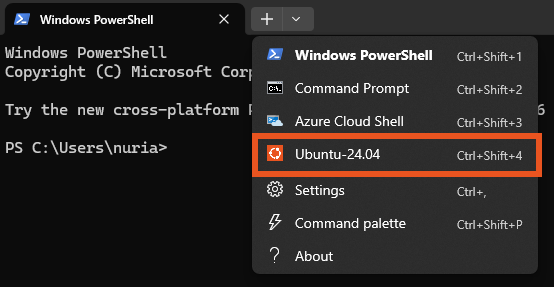

# cel-rnaseq: A Snakemake pipeline for *Caenorhabditis elegans* RNA-seq data

## Overview
Snakemake pipeline for Differential Gene Expression of *Caenorhabditis elegans* RNA-seq data. It accepts raw fastq files and generates raw count matrices.

The following is a tutorial on the usage of this pipeline.
- If you are using Windows, start from **Step 1**.
- If you are using MacOS or Linux, start from **Step 2**.
- If you already configured the pipeline previously, start from **Step 6**.

## Installation

### 1. Install Ubuntu in WSL2
When working in Windows, we will install Ubuntu as a subsystem since Snakemake works best in a Unix shell. WSL2 is already installed in Windows 11 and many Windows 10 versions, but for older systems check [this tutorial](https://learn.microsoft.com/en-us/windows/wsl/install-manual).

In a Windows PowerShell, run:

```
wsl --install Ubuntu-24.04
```
Otherwise, `wsl --install` will install the default Linux distribution (usually the latest LTS Ubuntu, which as of May 2026 is Ubuntu 24.04) and you can see all the distribution options at `wsl --list --online` .

Then, the PowerShell will prompt user and password creation like this:
```
Create a default Unix user account:
New password:
Retype new password:
```
After, the PowerShell will run Ubuntu.

For ease of use, install the [Terminal app](https://apps.microsoft.com/detail/9n0dx20hk701) because it is visually intuitive. You can open it and select the Ubuntu terminal:

<div align="center">
  
</div>


More complete tutorials can be found [from Microsoft](https://learn.microsoft.com/en-us/windows/wsl/install) and [from AskUbuntu](https://documentation.ubuntu.com/wsl/latest/howto/install-ubuntu-wsl2/).

### 2. Clone the Pipeline Repository

Use git to download the pipeline from GitHub:

```
git clone https://github.com/nuriagaralon/cel-rnaseq.git
```

### 3. Install conda via Miniforge

The pipeline used Miniforge v24.11.3, which can be downloaded with:

```
wget
https://github.com/conda-forge/miniforge/releases/download/24.11.3-0/Miniforge3-Linux-x86_64.sh
```

The latest version can be downloaded with:
```
wget https://github.com/conda-forge/miniforge/releases/latest/download/Miniforge3-Linux-x86_64.sh
```

Afterwards, install and answer yes to all questions:

```
bash Miniforge3-Linux-x86_64.sh
```
Then, reset the console so it loads our conda installation:

```
 source ~/.bashrc
```

### 4. Configure the general conda environment

Create the environment for Snakemake using the provided file, and activate it.

```
conda env create -f cel-rnaseq/config/snake_env.yaml
conda activate snakemake
```

### 5. Prepare the raw data and reference genome

Download the reference files, using the `dl_WBcel235_ref.sh` script:

```
cd cel-rnaseq/raw_data/references
bash dl_WBcel235_ref.sh
```

This places the required FASTA (genome) and GTF (annotation) files in the resources folder. 

Return to the `cel-rnaseq` folder:

```
cd ../..
```

## Running the pipeline
[!WARNING]
If the pipeline has been run before, make sure to clean the `results` folder to avoid pipeline crashes.

### 6. Prepare the raw reads and config metadata

The Ubuntu folders can be acessed from the Windows file system. To edit files easily, you can [run VSCode with WSL](https://learn.microsoft.com/es-es/windows/wsl/tutorials/wsl-vscode).

Add the raw sequencing files (fastq.gz) to the samples folder, at `cel-rnaseq/raw_data/samples` 

Edit the general config file `cel-rnaseq/config/snake_config.yaml` to include the sample names and file paths, and other experimental parameters.

For example, this is a snapshot of the `snake_config.yaml` file for two samples: Exp_2_3 and Neg_1_2.
<div align="center">
  
</div>

- The RNA-seq library must be a paired-reads library.
- In `samples`, write each sample name and indicate the two files (forward and reverse reads) that are found in the `raw_data/samples` folder.
- In `pairedreads` indicate the used nomenclature: each sample has two files like `Neg_1_2_{pairedreads}.fastq.gz`. In this case it is 1 and 2, but sometimes it is FW and RV or F and R.

### 7. Dry Run

From the `cel-rnaseq` folder (use `cd ..` to move back one folder as needed and `cd folder/` to move to a folder), run:

```
snakemake -np all
```

This will start a dry run where snakemake runs `rule all` (which executes the entire pipeline) and checks the pipeline logic but doesn't execute the programs (`-n` flag) and prints the process to the terminal (`-p` flag).

From this, we can see if there was an error with the config file, if the raw data was not added, if the reference data is missing, and other basic problems.

### 8. Execute the Workflow
Run the full pipeline with the `--use-conda` flag for reproducibility:

```
snakemake -p --use-conda all
```
The pipeline can be run with less than the full capacity of the computer (recommended for multitasking) at the cost of longer runtime. First, check the available cores:
```
nproc
```
Then, run using a specific number of cores:

```
snakemake -p --use-conda --cores 8 all
```

[!TIP]
The jobs are usually programmed for $2^p$ cores, so 4, 8, 16 are good numbers.

### 9. Monitor Performance

If an error occurs, the pipeline may crash and display error messages in red text to the terminal. In many cases, Snakemake will automatically remove incomplete output files from the failed rule, so simply rerunning the same command as Step 8 may resolve temporary issues.

[!TIP]
If the pipeline gets interrupted, Snakemake can detect which jobs already finished, so rerunning `snakemake -p --use-conda all` will only rerun the necessary steps.

A problem with `snake_config.yaml` would have been detected in the dry run, so failures at this stage can be: 

-	Bad file contents (e.g. the RNAseq FASTA files or reference files are corrupted)

-	Conda environment installation issues (remove the offending environment from `.snakemake/conda`)

-	Disk space errors (free up storage or process less samples at a time)

-	Incorrectly generated outputs

-	Tool failures

The **MultiQC tool** can cause issues if there is a past file in the folder: it will automatically add `_1` after the created file, and since it is not the file Snakemake is looking for, it will think the job failed. Erase the files and try again.

More information of the run can be found in the logs/ and benchmarks/ folders.